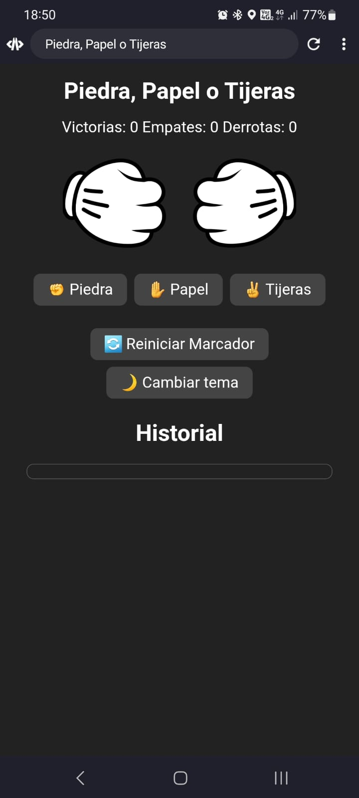

# Piedra, Papel o Tijeras

[](https://github.com/jonaaxsic)
[](index.html)
[](styles.css)
[](script.js)

Juego clásico de Piedra, Papel o Tijeras con animaciones, historial y cambio de tema. ¡Compite contra la CPU y guarda tus resultados!

## Características

- Animaciones de manos al jugar
- Historial de partidas
- Marcador persistente con `localStorage`
- Cambio de tema claro/oscuro
- Sonidos de victoria, empate y derrota

## Capturas de pantalla

### Animación en acción


### Vista completa del juego


## Instalación y uso

1. Clona el repositorio o descarga los archivos.
2. Abre `index.html` en tu navegador.

```sh
git clone https://github.com/jonaaxsic/piedra-papel-tijera.git
cd piedra-papel-tijera
start index.html
```

## Estructura del proyecto

```
index.html
styles.css
script.js
img/
    Gif.gif
    imagencompleta.jpeg
    papelCpu.png
    papelP1.png
    piedraCpu.png
    PiedraP1.png
    tijeraCpu.png
    tijeraP1.png
```

## Autor

- [jonaaxsic](https://github.com/jonaaxsic)

---

¡Diviértete jugando y mejorando tu marcador!
